# Hudson Test Anomaly Detection

## Getting Started

The first step is creating your very own `.env` file in the root directory. It should contain the following:

```env
MSSQL_USERNAME=<HOST>\\<USER>
HOST = <YOUR_HOST_DEVICE>
DRIVER = <YOUR_DRIVER>

MSSQL_USE_WIN_AUTH=true (false in case of linux)

PROJECT_FOLDER=<ABSOLUTE_PATH_TO_PROJECT_ROOT>

EXPORTER=<ABSOLUTE_PATH_TO_wkhtmltopdf>

HUGGINGFACE_TOKEN=<HUGGENING_FACE_TOKEN>
```

### Windows next steps

Before getting started with the project we assume you have the original Huson database installed with the name "CRH".

For the decoding part we asume you have .NET 8 and Visual Studio installed. \
Make sure the following 6 files are in `decoderen\DecoderApp\DecoderApp\bin\release\net8.0\publish` by publishing the visual studio `DecoderApp` located in `decoderen\DecoderApp\DecoderApp` \
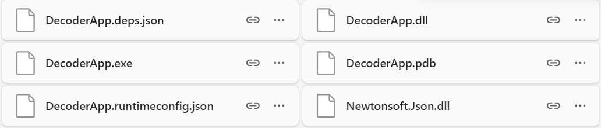

The next step to start using this project is installing the requirements as described in `./requirements.txt`.

### Linux next steps

Install wkhtmltopdf for pdf-exports: `sudo apt-get install wkhtmltopdf` or look at [python-pdfkit docs](https://pypi.org/project/pdfkit/)

Linux requires som extra env vars.

```env
MSSQL_USERNAME=<username>
MSSQL_SA_PASSWORD=<your very strong password>
MSSQL_LOCAL_PORT=<PORT>
## Using windows auth
MSSQL_USE_WIN_AUTH=false

# Docker config
CONTAINER_NAME=dep2g2-mssql-server
MSSQL_DATA_VOLUME_NAME=dep2-mssql-server-data
```

- Creat and activate a venv (name it venv), and install the requirements \
- Copy the `CRH.baqpac` int `mssql` folder \
- Run `$ docker compose --profile setup up -d`
- Watch `$ watch docker container ls -a` until `mssqldb.configurator` & `datadecoder.creator` are finished, which can take a minute or two. (Those are loading the .bacpac into the mssql server and creating the DecoderApp executable)

### Pipeline

The second step is running the [decoding script](./pipeline/decoding_pipeline.py). This will decode the hexadecimal strings for all tests in FCA, SJT, PAQ, BAQ and MDQ. It is only recommended to do this if you don't have the decoded data yet, because it takes a really long time to run.

The next step is running the pipeline with [the python pipeline script](`./pipeline/pipeline.py`).
This will create the Data Warehouse (DWH) as described in [the DWH section of this document](##_data_warehouse).
It will also create csv-files which will in turn be used to analyse the data and detect outliers as described in [the Anomaly Detection section of this document](##_Anomaly_Detection). The conclusion from the anomaly detection is in turn saved in csv-files.
Those files are then used to fill the DWH with all decoded and analysed data.

For the export function from streamlit you need te install [wkhtmltopdf](https://wkhtmltopdf.org/downloads.html).
To start the streamlit dashboard use the command `streamlit run dashboard/Overview.py`.

## Additional Information

### Data Warehouse

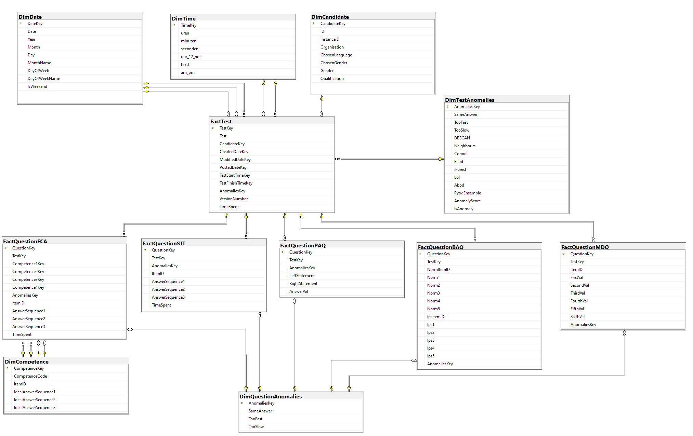

**FactTest** is the table that consist of instances of tests taken at a certain time and date by a certain candidate. The time and date point to instances of **DimTime** and **DimDate** respectively. The CandidateKey points to **DimCandidate**, a table containing all information regaring each candidate that ever took a Hudson test.

Depending on the test type (FCA, SJT, PAQ, BAQ or MDQ) each test is referenced by either **FactQuestionFCA**, **FactQuestionSJT**, **FactQuestionPAQ**, **FactQuestionBAQ** or **FactQuestionMDQ** containing answers to each of the tests.

Each test has a unique AnomaliesKey pointing to **DimTestAnomalies**, the table that contains a column for each anomaly detection method used, where the value for each represents whether or not the model flagged the test instance as an outlier. The question tables refer to **DimQuestionAnomalies** in a similar way.

The **FactQuestionFCA** points to **DimCompentence**, the table that contains a competence code and an ideal answer for each subquestion.

#### Optimalisation

After the filling of the DWH, a script runs that does some finishing touches to the data and adds indexes and indexed views. These indexes and views are added based on the most commonly used queries for the streamlit dashboard to minimize the loading time.

### Anomaly Detection

#### Abod

ABOD stands for Angle Based Outlier Detection. For every 3 instances, the "angle" between the datapoints is measured (note that this angle can be visualised in 2 dimensions, but the principle holds for any number of dimensions). The total variance of angles an instance has using every set of 2 other instances is calculated. Inliers generally have a larger variance than outliers, and thus the x% of instances with the smallest variance are considered to be anomalies. (Consider a group of people standing in a circle and 1 person 10m away from this circle. If the person in the middle wants to see everybody, he'll have to turn around almost 360° to see everyone, while the person standing 10m away will only need a perceptive field of a couple degrees).

#### Copod

COPula based Outlier Detection uses statistical principles to consider the top x% of instances in a dataset as anomalies. A copula is a measure for the dependency between variables. The algorithm depends on the assumption that outliers have attributes that are not aligned with the majority of the instances, and therefore its measure will be different to others. The way this is implemented in the python outlier detection library is that it ranks instances on this value to filter out the top x%.

#### Ecod

This model uses Empirical Cumulative distribution functions of the underlying data. Outliers are considered events that are frequently present in the tails of a distribution. For every dimension (attribute), distribution functions are calculated and the tail probability is calculated. This is aggregated for all dimensions of an instance which is a measure for the abnormality. Again, the top x% abnormal instances are considered anomalies.

#### iForest

Isolation Forests is a machine learning algorithm where trees of instances are formed. A tree is formed by iteratively and randomly selecting features and splitting the dataset according to a (random) threshold. This process is repeated in order for certain leaves to contain a single instance (hence being isolated). The longer the path between the root node and the terminating node (the node which has one instance), the more normal this instance is perceived as. This value is averaged over a certain amount of trees, which together create a forest.

#### Lof

Local Outlier Factor tackles a problem that exists when using KNN: KNN is good at finding global outliers (those that are far from every other instance), but not at finding local outliers. Again, distances to an instance's K neighbours are calculated, but now they are used to measure local densities. Varying densities are picked up and when an instance is located in a significantly sparser region than it's neigbours, it is considered an anomaly.

#### Neighbours

K Nearest Neighbours measures the distance between data points. "K" is a preset integer that this model will take as a parameter, which represents the amount of closest neighbouring instances that will be used to calculate a total distance measure per instance. The instances that have a large average distance to it's neighbours are considered less normal. This way, a ranking can be made to identify the most abnormal instances (and label them as anomalies).

#### DBScan

DBSCAN is an unsupervised clustering algorithm. It starts with identifying core instances first, which are instances that are located within a certain euclidian distance from other instances. The amount of other instances it needs to have within this distance is set before training this model. When these instances are marked, clusters are formed by gathering all instances (even other core instances) that lie within a preset distance of a core instance in a cluster. Overlapping clusters are merged into one. When this is done for all core instances, the majority of non-core instances will be allocated to a cluster. All those that are not allocated are considered to be an anomaly.

#### PYOD Ensemble

The ensemble is a way to represent consensus of multiple different pyod models on different dataframe types to know wheter an instance is considered an anomaly or not. Each indiviual decision maker takes out 5% of the tests which it thinks to be strange. Some models may look in its neighbourhood, others might compare towards the average or cluster center in general, while others may be calculating angles between different points.

To consider which test will be annotated as an outlier, at least half of them need to agree on the outlier.
See [pyod_ensemble.md](./extra/pyod_ensemble.md) for a more detailed explanation, road to and examples.

#### Same Answers

##### Test

This detection method first determines which answer was given most often within the test. It then calculates the percentage of answers that correspond to the most frequently given answer and saves this value as 'SameAnswerPercentage'. If the percentage is any higher than 50% the test is flagged as an anomaly.

##### Question

This detection method analyses the answers on subquestions within a question. It simply checks whether the answer to every subquestion is the same, and if so, detects the 'SameAnswer' anomaly within the question.

#### Too Fast and Too Slow

##### Test

The time the candidate spent on completing the entire test is used to first calucate the average and the standard deviation (std). Afterwards every test is checked and tests that took more than the average plus the std are considered significantly slower, while tests that took less than the average minus the std are considered significantly faster.

##### Question

This method is similar, but the avg and std are calculated per ItemID, to account for different questions that might intrinsically require more time.

#### Anomaly Score and Anomaly Conclusion

The anomaly score represents the percentage of detection methods that flagged the test as an anomaly. The interquartile range is used to determine the threshold for the anomaly score. Any tests with an anomaly score higher than the threshold will be considered an anomaly.

### Tests

#### FCA

This test investigates what actions a test person would take given an exemplary situation, usually reacting to a given e-mail. For a given situation, there are 3 statements to which the user can respond. Every statement needs to be quoted based on how inclined to this statement a user would be. These quotations are stored as integers ranging from 1 to 5 included. An important note is that there are several variations of every test, which makes the results more robust and therefore harder to predict the ideal answer.

#### SJT

The Situational Judgment Test is similar to FCA, situations that can happen at work are shared in order for the employer to assess how the user would react in real life. The main goal if this test is to compare how well the values of the company and the test person align. Real time feedback is given to the user in order for him to align where necessary. Every statement has an ideal answer based on what the assessor values most.

#### PAQ

PAQ is a Personality Assessment Questionnaire. As the name indicates, PAQ evaluates a range of personality traits by making the test person choose how well one of two statements (which are opposites) match their character. This way every question holds 2 traits and the answer given. Comparing all traits at the end of the test shows which traits stand out from others in a relative way.

#### BAQ

The Behavioral Assessment Test is used for a company to try and predict how a test person naturally behaves. In each item, 5 completely different statements are shown. The candidate must state how much he agrees to every statement. Furthermore, he needs to indicate how much the statement is applicable to him. The latter generates a ranking. These normative and ipsative scores are used in the assessment.

#### MDQ

MDQ stands for Motivational Drive Questionnaire and intends to figure out personal drivers. These drivers are what makes a person achieve better results when present in their daily working environment, so it can be useful for the employer to know. The user is given 3 statements per item which he needs to rank. The results of these tests are summarized and scores for a range of drivers are calculated.

### Using the Dashboard

#### 1. Overview

The inital screen that is displayed upon opening the streamlit dashboard is the Overview. On the Overview some general graphs are displayed to visualize the gender and qualification distribution for all tests, as well as the number of anomalies per qualification. A count of the total number of tests and a count of the total amount of candidates that ever took tests is displayed at the bottom of the page.

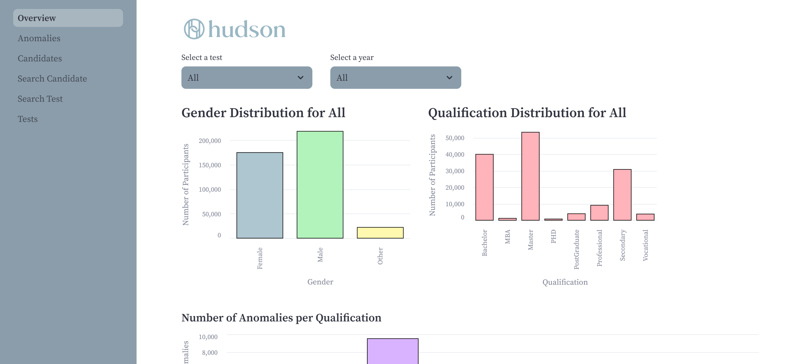
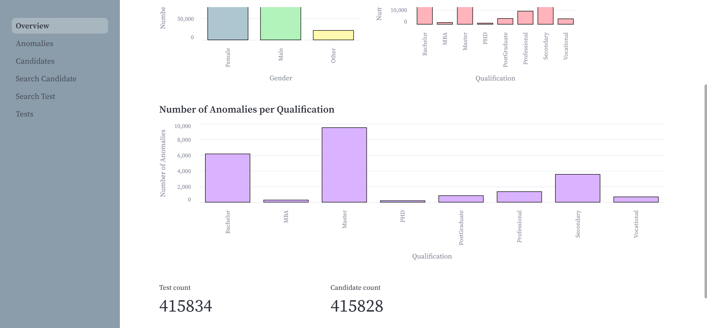

The visualized data can be filtered per test and per year, to create custom graphs.
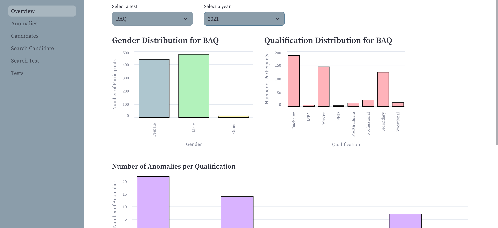

#### 2. Anomalies

After selection a description of the detection method and a graph displaying the yearly occurence of the anomaly are shown, followed by a list of clickable instances of every test that was flagged by the detection method.

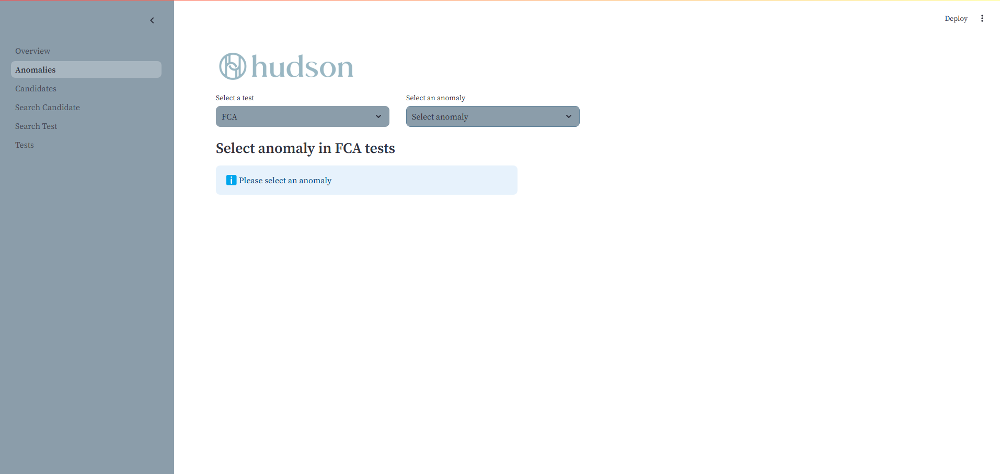
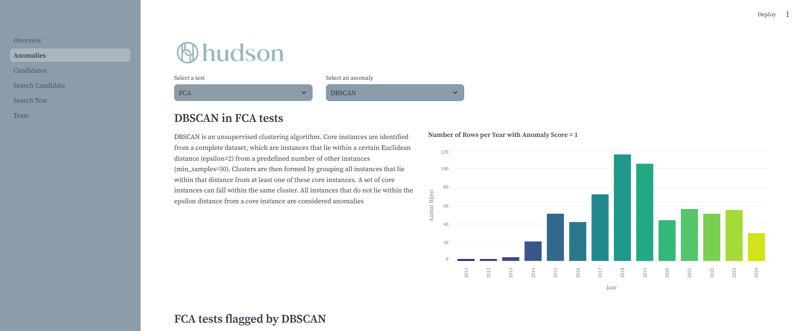
To display more detailed information about any test in the list, the user can click on the box in the very first column of the table, and will be redirected to the Search Test page for the selected test.

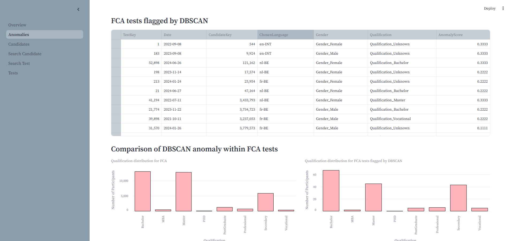
After that a comparison is made between the qualification and gender distribution of both the flagged tests and all tests.
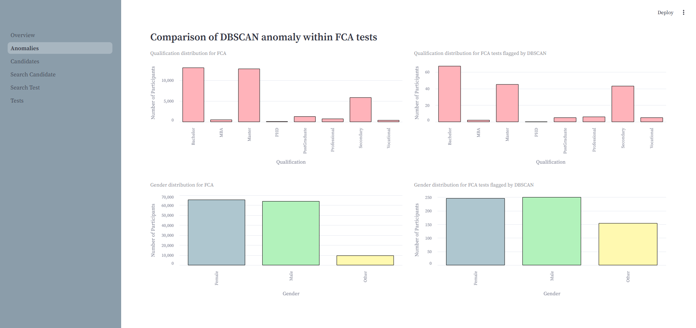

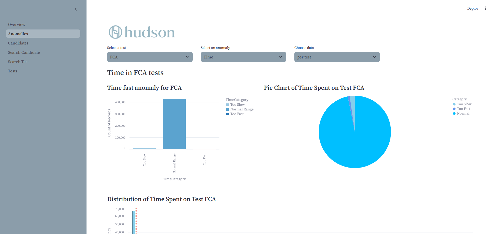

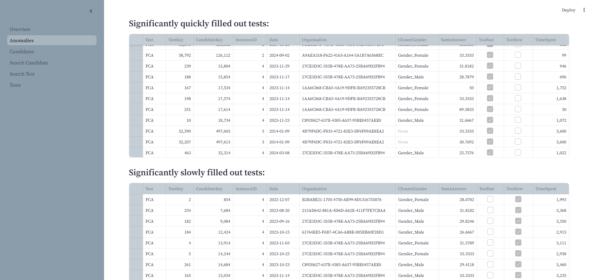

#### Candidates

On the Candidates page a list of all candidates is displayed with information regarding the test they took. The list can filtered on testtype, year, gender, anomaly score, what detection method it was flagged by and whether or not it is an anomaly.

Each candidate instance in the list can be selected to display more information about the candidate and their test(s). To select a candidate, the user can click on the box in the very first column of the table, and will be redirected to the Search Candidate page for the selected candidate.
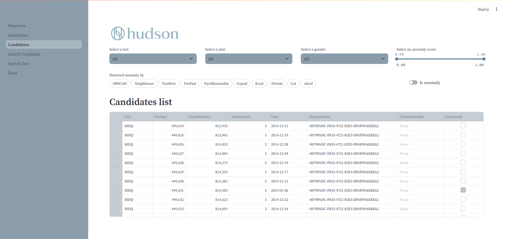

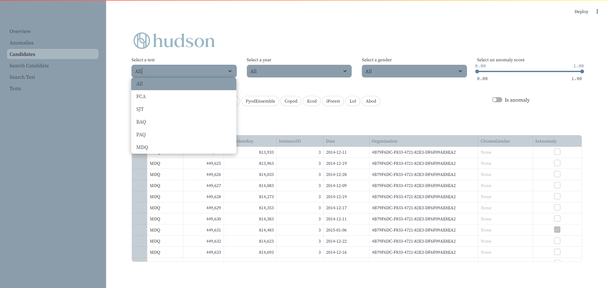

#### Search Candidate

On the Search Candidate page a Candidate Key can be supplied to then retrieve detailed information about the candidate and the test(s) they took.

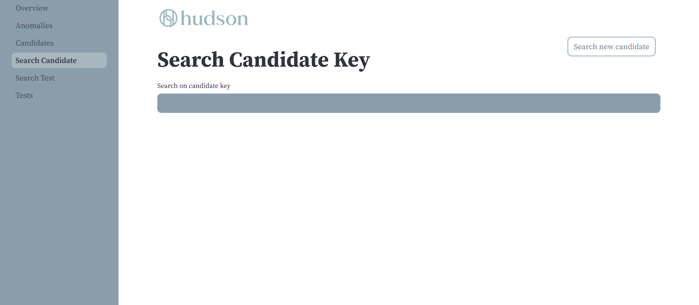

This information includes a table with an overview of the the testtype, date, Test Key, organisation, language and anomaly score. The next part describes the anomaly detection results, starting with an overview and followed by a detailed description of any detection method that flagged the test as an anomaly.

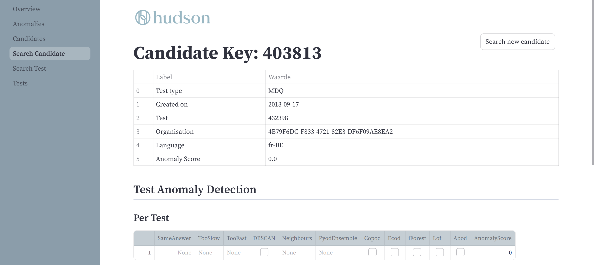
Next there is the possibility to recieve an AI-generated summary and the possibility to export all information on the page.
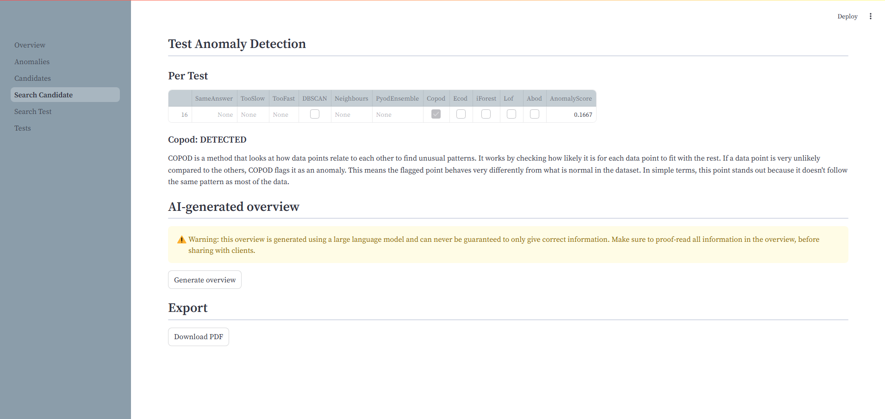

#### Search Test

On the Search Test page a Test Key can be supplied to then retrieve detailed information about the test.
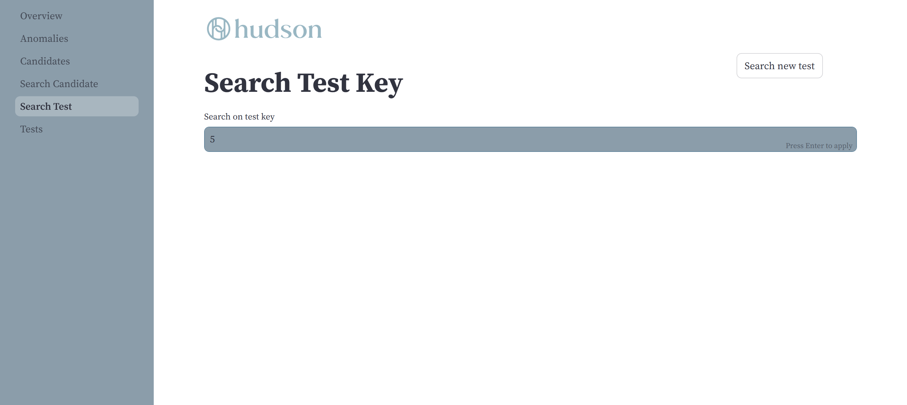
This information includes a table with an overview of the the testtype, date, Candidate Key, organisation, language and anomaly score. The next part describes the anomaly detection results, starting with an overview and followed by a detailed description of any detection method that flagged the test as an anomaly.
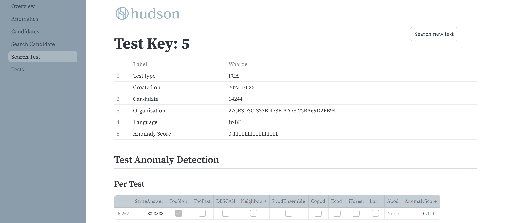
Next up every question in the test is listed with any detected anomalies within the question.
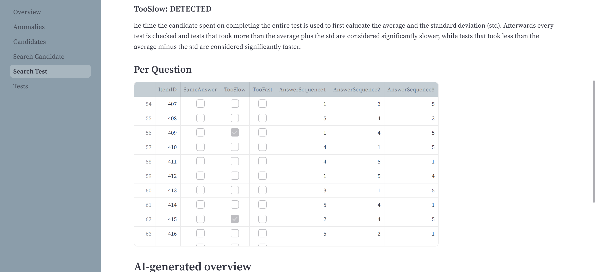
At the bottom of the page there is the possibility to recieve an AI-generated summary and the possibility to export all information on the page.
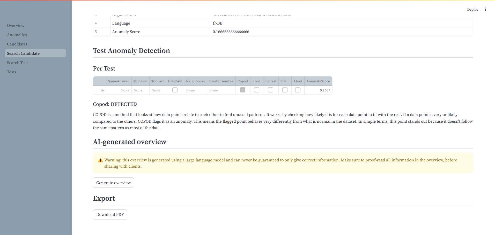

#### Tests

On the Test page a list of all testinstances is displayed. The list can filtered on testtype, year, gender, anomaly score, what detection method it was flagged by and whether or not it is an anomaly.

Each test instance in the list can be selected to display more information about the test. To select a test, the user can click on the box in the very first column of the table, and will be redirected to the Search Test page for the selected test.

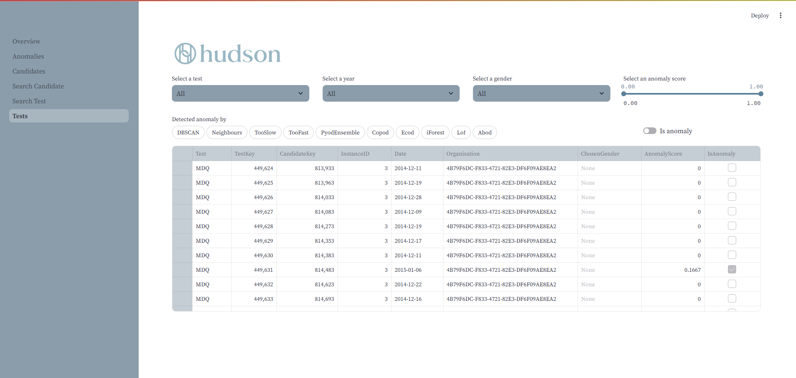
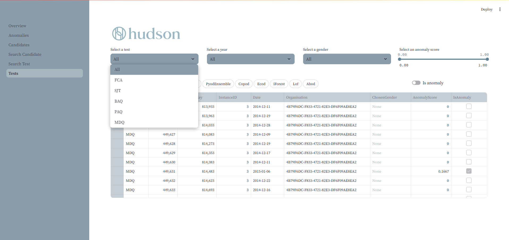

### API

The API linked to this projects DWH can be found on [GitHub](https://github.com/monadierickx/api-dep2).

## Known Issues

### LLM

As the AI-generated overview is made using an LLM, there is always a possibility that the summary is incomplete or (partialy) incorrect. The LLM has been tested and prompt-engineered, but slip-ups are not completely impossible. A warning is included on the dashboard, to ensure the client is aware of the risks.

### Insufficiënt memory

In case you notice that there is no `FactTest.csv` or `FactQuestion.csv` in `decoded_data/BA51`, make sure you have >10GB memory.
Test out `decoderen/BAQ_csv_for_DWH.py` individually to be sure
available to store the data temporarily.
Then rerun the `pipeline.py` script from `run_csv_scripts` onwards. You can comment out the other functions.
