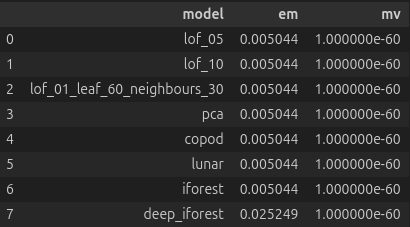
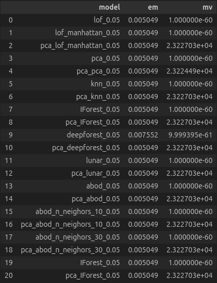
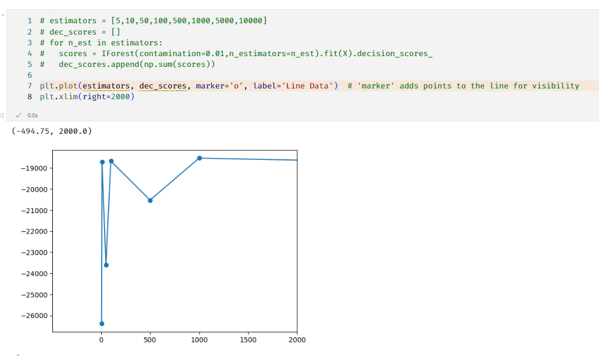
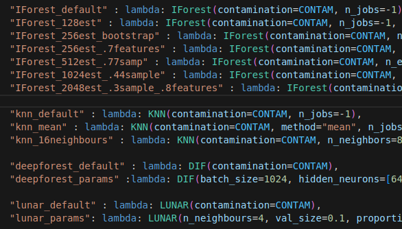

# The pyod ensemble

This file contains a more extended description of the anomaly detection using pyod, while exploring pyod models.
Although we tried to get the best model, we find that it was hard to measure individual model performances. We tried using the decision function of models or the EMMV scores, but thought it was not really representing how well a model was performing.

This results in the decision to build a pyod ensemble, with multiple chosen parameters, while trying to equaly represent all chosen models, e.g. LOF or IForest.

## Comparing models

### Comparing unsupervised models - EMMV metric

EM = Excess Mass
MV = Mass volume

We found a way to try and compare unsupervised models ([How to Evaluate the Quality of Unsupervised Anomaly Detection Algorithms?](https://arxiv.org/pdf/1607.01152)), in the paper they prove, using data that has labels, that the EM & MV metrics align closely with the best performing models, according to the ROC curve or PR score (precision-recall).

This EMMV method has a [github implementation](https://github.com/ngoix/EMMV_benchmarks) provided in a python module [python emmv module](https://pypi.org/project/emmv/)

However, when trying out the metric, results weren't as expected.
For all models, except one, the metrics gave the same value.
On the first try, it seemed the excess mass value was ok, in terms of range, but no distinct values to compare. However the mass volume was nowhere near as good.
When we sent our values through a PCA, a better mv was reached, however, still no real comparisons could be made.




```python
scaler = MinMaxScaler()
scaler.fit(df)
X_train = scaler.transform(df[:LEN_TRAIN])
X_test = scaler.transform(df[LEN_TRAIN:])
pca = PCA(n_components=10)
X_train_pca = pca.fit_transform(X_train)
X_test_pca = pca.transform(X_test)
```

### Decision function

Another idea was to compare the total sum of the decsion function. (Each pyod model is required to have a decision function)
However, we believe that the decision function is not representing the performance of the model. Pyod models, using the decision function, give to one X a score, to decide wether a value is an anomaly or not. So summing the total only represents how distinct, or compact the data is. Many normal values will lower the score towards the normal score and anomalies contribute towards a positive score. But one X only decides how normal/abnormal the value is. Summing up, doesn't really give that much meaning in the end.



### Similarity between models

As different parameters can affect the selected neighbourhood, amount of trees, comparing the amount of neighbours in a distance, thresholds or dimensions which can slightly adapt results. Just comparing how much values are labeled the same as another model can give a similarity score. This way, we'll know how different trained models evaluate tests.

## The ensemble

The ensemble is a way to represent consensus of multiple different pyod models to know wheter an instance is considered an anomaly or not. Each indiviual decision maker takes out 5% of the tests which it thinks to be strange. Some models may look in its neighbourhood, others might compare towards the average or cluster center in general, while others may be calculating angles between different points, to consider which will be annotated as an outlier.

### Flow of the ensemble

Each test, FCA, SJT, BAQ or PAQ has another differentiation of storing its data. Thus a `dataframeBuilder` is created for each test to create the input data needed to be trained on.
Additionaly, Principal Component Analysis is added to create a second train set on ten dimensions, to decrease feature amount and provide a second possible dataframe.

Starting from the same point, multiple pyod models are defined which will be fitted on the data. As some could have more parameters to tune, compared to others, after fitting, a selection will be performed to keep the three most different models of the same type (e.g. IForest or LOF), in order to have more spreading in the predictions.
This decision is rather arbitrary. There a pro's and con's.

Positive:

+ Slight differences between params would weigh more in the end decision
+ E.g. IForest is in the end the same model, so having 6 or more forests only plays to the advantage of the forest opinion seeping through in the final decision
+ More diversity

Negative:

+ A total underfit of a model, e.g. by to few trees in the forest, adds a stupid model in the final decision.
+ Still no way of knowing if chosen params are acceptable.
+ Longer training times

Example of current existing models in the ensemble.



When half of the predictors agree, a test is considered an outlier.
